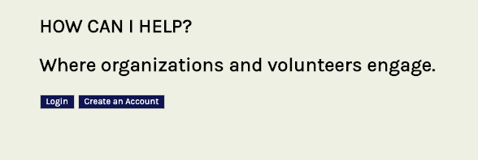
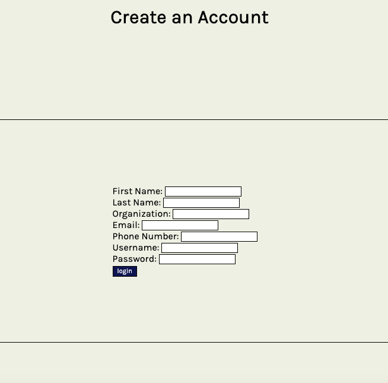
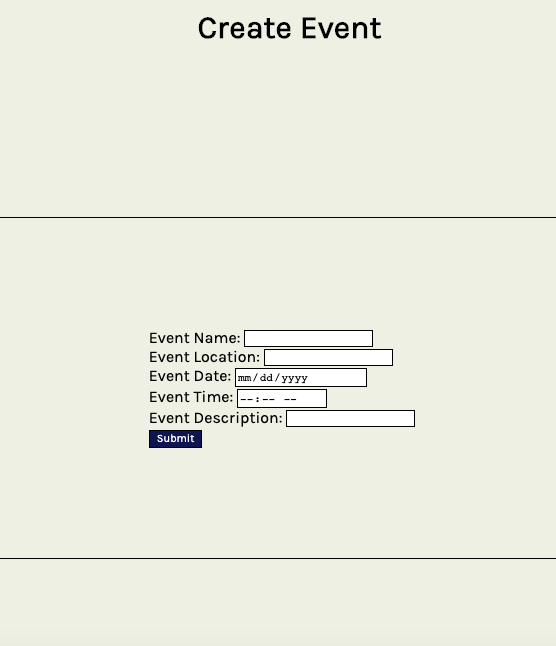

# How can I help?

An app that simplifies managing events and volunteers.

## What problem does our app solve?

One challenge that non-profit organizations face is managing volunteers and events. Our app seeks to allow a volunteer coordinator the ability to create an event with tasks so that their volunteers can sign up to help out. While we built this app with non-profits in mind, any company or private individual can use this app to manage events.

## Description of how the app works.

Homepage:  

Our app allows users to create a profile.

Once their profile is created they have the ability to create events and tasks for those events.

A volunteer can then view those events and select what task they would like to complete.

Then our users are able to view the events they've created and the events they are attending.

## Structure of our databases.

Our database consists of 4 different data tables. One to store events, one to store user information, and two other linking tables that store tasks of the events and assigns those tasks to users.

## What features you would add next?

The ability to search for events based on location and organization.

Restructure the user profiles so that a user can operate under an organization, and not as an individual profile. This would allow a user to view all events assigned to an organization and give admin abilities to the organization over user accounts.

### Contributors include: Aylor Brown (@aylorbrown), Catie Evans (@evanscatie), and Travis Franklin (@Travis-Franklin)